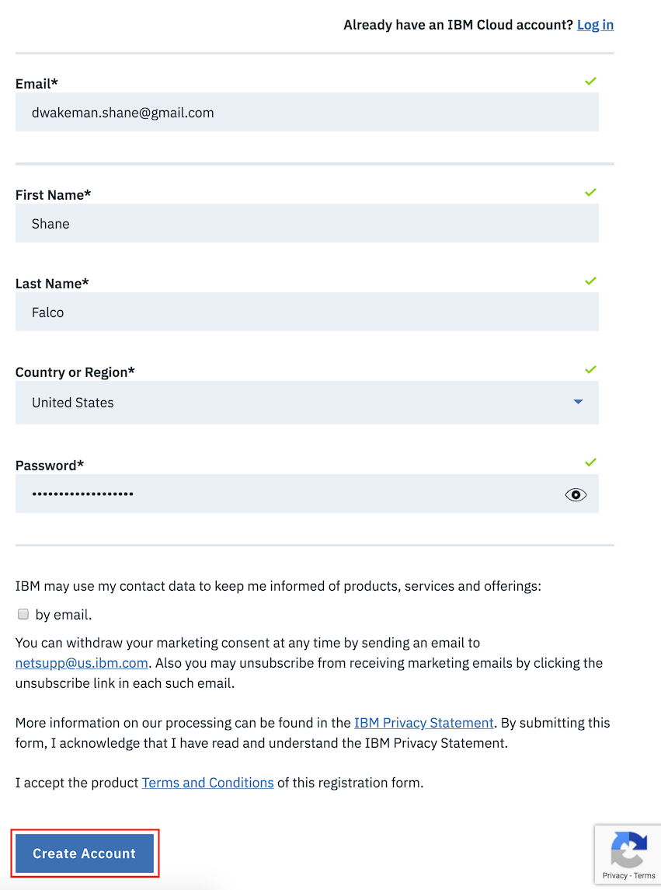
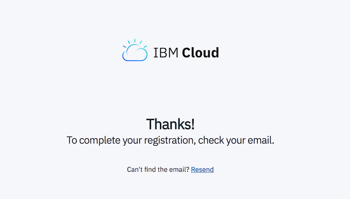
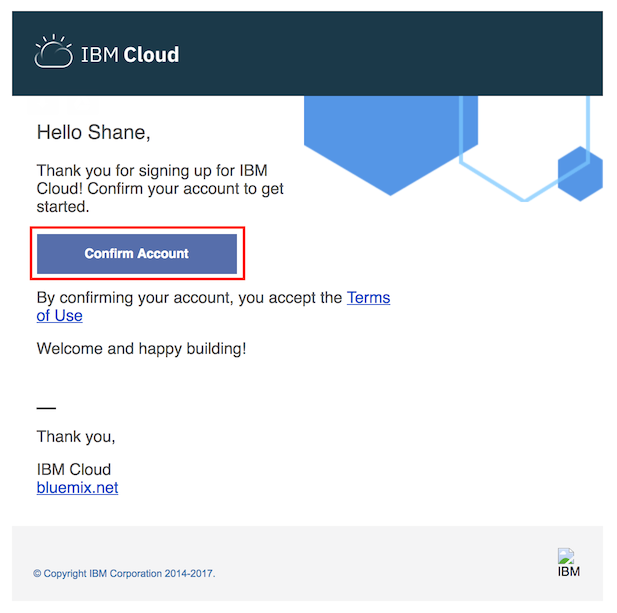
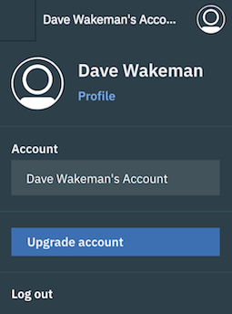
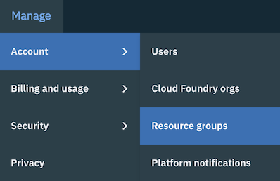
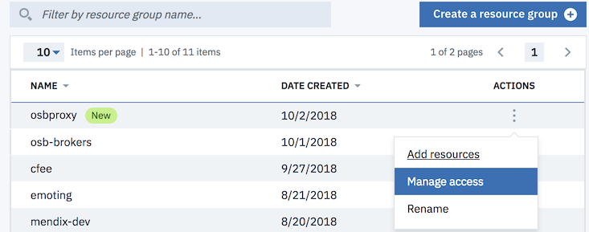
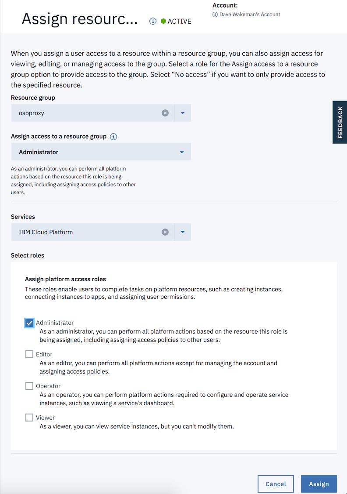

# Setting up an OSB Broker Proxy for Cloud Foundry

## Overview
The IBM Cloud catalog contains a wide variety of services that can be consumed by Cloud Foundry applications no matter where they run. This page contains instructions for setting up an OSB Proxy that can be used for an on-premise Cloud Foundry implementation.

## IBM Cloud Setup

### Create an IBM Cloud Account
- Go to [https://www.ibm.com/cloud/](https://www.ibm.com/cloud/) and click the "Sign Up" button

*__Note:__ If you already have an IBM Cloud account you can click the `log in` link on the sign up page to login, then proceed to the next section, `Exploring IBM Cloud`.*

To create your account fill in the required fields and click the `Create account` button at the bottom.  You will need to provide a password that conforms to the password format policy before you can click the button.



When you have created your account you will see this in the browser:



Now it's time to check your email.  You should have an email from `IBM Cloud` that looks like this.  



Click the `Confirm Account` button.  You should see this in your browser:


Now you have an IBM Cloud Account!!  Click the `Log in` button to login and check it out!  Review the account privacy policies and click the `Proceed` button if you agree.

### Upgrade to a Pay-As-You-Go Account

Click on your avatar at the top right and then click `Upgrade Account`.



Provide the required information to upgrade your account.

### Create a new resource group

When logged into your account, go to the `Manage` tab in the top toolbar and click `Account -> Resource Groups`.



Click the blue `Create a resource group` button on the right.

Give your resource group a name, such as `osbproxy`.  Click `Add`.


### Create a new access policy

In order to create the proxy you need to have at least Editor or Administrator permissions for the `IBM Cloud Platform` service to the user that will create the proxy.

You should see your new resource group at the top of the list.  Click the 3 dots in the Actions column, then click on `Manage Access`.



This will take you to the list of users in your account.  You will probably only see your own userid if you just created the account.

Click on your userid.  You will see a list of access policies that exist for your user.  Click on the blue `Assign Access` button on the right.

Click the box labeled `Assign Access within a resource group`.

Select your resource group.

In the dropdown labeled `Assign access to a resource group` choose `Administrator`.

In the dropdown labeled `Services` choose `IBM Cloud Platform`.  This is the service that represents the OSB Proxy component in IBM Cloud.  Later we will create an instance of this component.

*__Note:__ You could choose `All Identity and Access enabled services`.  That would give you access to all of the services that support IAM, not just the `IBM Cloud Platform` service.  You might do this if you plan to add other services into this resource group.*

In the `Select roles` section choose `Administrator`.  This is the overall role that your user will have within the resource group.  

Your screen should look similar to the one below.  Click `Assign`.



That's all we need to do in the web console.  Now we will switch to the command line interface

### Create the Proxy

__Install IBM Cloud CLI__

The proxy is created using a REST API, but first we need to get some information about your account from the IBM Cloud CLI.  Documentation for installing it can be found [here](https://console.bluemix.net/docs/cli/reference/ibmcloud/download_cli.html#install_use).

To use the IBM Cloud CLI, open the appropriate tool on your laptop.  These instructions were written on a mac.

__Gather required information__

Login to the IBM Cloud CLI by using this command:

`ibmcloud login`

Specify your email and password when prompted.  If you are a mamber of more than one IBM Cloud account you may be prompted to choose the account you wish to target.  If so, choose the appropriate account.

The API for creating a proxy requires you to specify the ID of your resource group.  You can get it using this command:

`ibmcloud resource group <your-resource-group-name>`

For example, if your resource group is named `osbproxy`:

`ibmcloud resource group osbproxy`

This should produce the following output:

```
Name:                     osbproxy   
Account ID:               9d5d528aa786af01ce99593a827cd68a   
ID:                       dbab516bf508474599c594b40193de03   
Default Resource Group:   false   
State:                    ACTIVE   
Quota:                    Pay-as-you-go Quota   
```

The value you will need later is the `ID` field.

The API uses Bearer Token authorization, so you will need to get an IAM Token using the CLI.

Run this command:

```
TOKEN=`bx iam oauth-tokens | grep "IAM token" | cut -d':' -f2 | awk '{print $2}'`
```

This will set an environment variable named `TOKEN` to the value you will need to provide.  

To make things easier in the next step, let's set a couple more environment variables.

Set an environment variable named BROKERNAME to the value you want to name your broker.  For example:

BROKERNAME=dw-osb-proxy-01

Set another environment variable to the ID of your resource group from the `ibmcloud resource group` command you ran above.  For example:

RGID=dbab516bf508474599c594b40193de03

__Create the Proxy__

You can create the Proxy in IBM Cloud using cURL, or your favorite REST API tool, such as Postman.

Here is the command for cURL:

```
curl -X POST https://resource-controller.bluemix.net/v2/resource_brokers -H 'authorization: Bearer '$TOKEN -H 'content-type: application/json' -d '{"name": "'"$BROKERNAME"'","resource_group": "'"$RGID"'","run_as_system": true}'
```

If the command works you will see some output like this:

```"id":"crn:v1:bluemix:public:ibmcloud-platform::a/9d5d528aa786af01ce99593a827cd68a::osbbroker:df543302-70b3-4817-9b96-2f1b3490272c","crn":"crn:v1:bluemix:public:ibmcloud-platform::a/9d5d528aa786af01ce99593a827cd68a::osbbroker:df543302-70b3-4817-9b96-2f1b3490272c","guid":"df543302-70b3-4817-9b96-2f1b3490272c","url":"/v2/resource_brokers/df543302-70b3-4817-9b96-2f1b3490272c","auth_username":"apikey","auth_password":"********-****-****-****-************","proxy_broker_url":"https://resource-controller.bluemix.net/ibmcloud-platform/df543302-70b3-4817-9b96-2f1b3490272c","resource_group_crn":"crn:v1:bluemix:public:resource-controller::a/9d5d528aa786af01ce99593a827cd68a::resource-group:dbab516bf508474599c594b40193de03","account_id":"9d5d528aa786af01ce99593a827cd68a","serviceid_crn":"crn:v1:bluemix:public:iam-identity::a/9d5d528aa786af01ce99593a827cd68a::serviceid:ServiceId-6765c956-daba-4b81-8d99-4f909d5a190f"}```

Copy this JSON output and paste it in a note somewhere; you will need some of the fields later when you create the service broker in Cloud Foundry.


## Cloud Foundry Configuration

I believe the CLI command to register the broker in Cloud Foundry can be found [here](https://docs.cloudfoundry.org/services/managing-service-brokers.html#register-broker)

It will be a command like this:

`cf create-service-broker mybrokername someuser somethingsecure https://mybroker.example.com/`

In that command you would replace `mybrokername` with a name of your choice.

`someuser` should be set to the `auth_username` in the response JSON from the API call that created the broker proxy.  In the example above, `someuser` would be `apikey`.  The value for `somethingsecure` would be the value of `auth_password`.  The URL in the command is the `proxy_broker_url`.

*__Note:__ This section will be updated once confirmed.*
